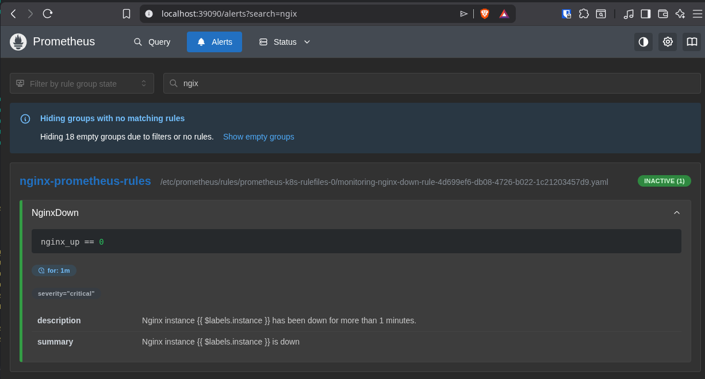
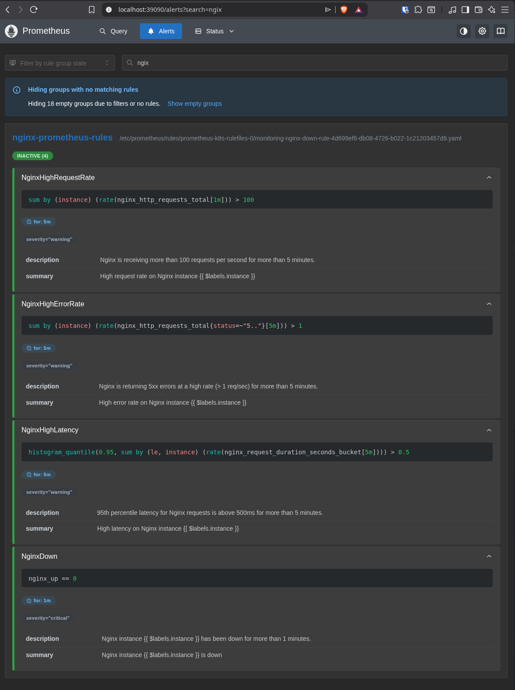

# Day 12 - Descomplicando os ServiceMonitors, PodMonitors e os Alertas no Kubernetes

## ServiceMonitors

ServiceMonitors são recursos do Prometheus Operator no Kubernetes usados para descobrir e monitorar serviços automaticamente. 
Eles definem como o Prometheus deve encontrar endpoints de serviços, coletar métricas e aplicar seletores de labels, facilitando a integração e o monitoramento de aplicações sem necessidade de configuração manual dos targets.

O ServiceMonitor define:
 - Quais serviços devem ser monitorados, usando seletores de labels.
 - Quais endpoints e portas devem ser acessados para coleta de métricas.
 - Intervalo de scrape (frequência de coleta das métricas).
 - Esquema de autenticação e TLS, se necessário.
 - Labels e parâmetros adicionais para customizar a coleta.

**Exemplo:**

```yaml
apiVersion: monitoring.coreos.com/v1
kind: ServiceMonitor
metadata:
  annotations:
  labels:
    app.kubernetes.io/component: prometheus
    app.kubernetes.io/instance: k8s
    app.kubernetes.io/name: prometheus
    app.kubernetes.io/part-of: kube-prometheus
    app.kubernetes.io/version: 2.41.0
  name: prometheus-k8s
  namespace: monitoring
spec:
  endpoints:
  - interval: 30s
    port: web
  - interval: 30s
    port: reloader-web
  selector:
    matchLabels:
      app.kubernetes.io/component: prometheus
      app.kubernetes.io/instance: k8s
      app.kubernetes.io/name: prometheus
      app.kubernetes.io/part-of: kube-prometheus
```

Este ServiceMonitor monitora os serviços que possuem as labels:

  app.kubernetes.io/component: prometheus
  app.kubernetes.io/instance: k8s
  app.kubernetes.io/name: prometheus
  app.kubernetes.io/part-of: kube-prometheus

E irá monitorar as portas web e reloader-web a cada 30s.

**Visualizar Customer Resource Definitions**

```bash
$ kubectl get customresourcedefinitions.apiextensions.k8s.io             
NAME                                           CREATED AT
accesscontrolpolicies.hub.traefik.io           2026-01-04T19:33:24Z
aiservices.hub.traefik.io                      2026-01-04T19:33:24Z
alertmanagerconfigs.monitoring.coreos.com      2026-01-28T18:06:47Z
alertmanagers.monitoring.coreos.com            2026-01-28T18:06:48Z
...
podmonitors.monitoring.coreos.com              2026-01-28T18:06:48Z
probes.monitoring.coreos.com                   2026-01-28T18:06:48Z
prometheusagents.monitoring.coreos.com         2026-01-28T18:06:48Z
prometheuses.monitoring.coreos.com             2026-01-28T18:06:48Z
prometheusrules.monitoring.coreos.com          2026-01-28T18:06:48Z
...
servicemonitors.monitoring.coreos.com          2026-01-28T18:06:48Z
thanosrulers.monitoring.coreos.com             2026-01-28T18:06:48Z
```

**Listar Service Monitors**

```bash
$ kubectl get servicemonitors.monitoring.coreos.com                     
No resources found in default namespace.
$ kubectl get servicemonitors.monitoring.coreos.com -A
NAMESPACE    NAME                      AGE
monitoring   alertmanager-main         7d
monitoring   blackbox-exporter         7d
monitoring   coredns                   7d
monitoring   grafana                   7d
monitoring   kube-apiserver            7d
monitoring   kube-controller-manager   7d
monitoring   kube-scheduler            7d
monitoring   kube-state-metrics        7d
monitoring   kubelet                   7d
monitoring   node-exporter             7d
monitoring   prometheus-adapter        7d
monitoring   prometheus-k8s            7d
monitoring   prometheus-operator       7d
```

## PodMonitors

**Criar Pod com Metrics**

```yaml
apiVersion: v1
kind: Pod
metadata:
  name: nginx-podmetrics
  labels:
    app: nginx-podmetrics
spec:
  containers:
  - name: nginx-podmetrics
    image: nginx:latest
    ports:
    - containerPort: 80
      name: http
    resources:
      requests:
        cpu: "100m"
        memory: "128Mi"
      limits:
        cpu: "200m"
        memory: "256Mi"
    volumeMounts:
    - name: nginx-metrics-config
      mountPath: /etc/nginx/conf.d/default.conf
      subPath: nginx.conf
  - name: nginx-exporter
    image: nginx/nginx-prometheus-exporter:1.5
    args:
    - '-nginx.scrape-uri=http://localhost/metrics'
    ports:
    - containerPort: 9113
      name: metrics
    resources:
      requests:
        cpu: "0.05"
        memory: "64Mi"
      limits:
        cpu: "0.3"
        memory: "128Mi"
  volumes:
  - configMap:
      defaultMode: 420
      name: nginx-metrics-config
    name: nginx-metrics-config

```

**Criar Pod Monitor**

**Criar configmap de configuração para o nosso pod-metrics**

```yaml
apiVersion: v1
kind: ConfigMap
metadata:
  name: nginx-podmetrics-config
  namespace: default
  labels:
    app: nginx-podmetrics
  annotations:
    description: Configuração customizada do nginx

data:
  nginx.conf: |
    server {
        listen       80;
        server_name  localhost;

        location / {
            root   /usr/share/nginx/html;
            index  index.html index.htm;
        }

        location /metrics {
            stub_status on;
            access_log  off;
        }

        error_page   500 502 503 504  /50x.html;
        location = /50x.html {
            root   /usr/share/nginx/html;
        }
    }

```

**Pod Metrics**

```yaml
apiVersion: v1
kind: Pod
metadata:
  name: nginx-podmetrics
  labels:
    app: nginx-podmetrics
spec:
  containers:
  - name: nginx-podmetrics
    image: nginx:latest
    ports:
    - containerPort: 80
      name: http
    resources:
      requests:
        cpu: "100m"
        memory: "128Mi"
      limits:
        cpu: "200m"
        memory: "256Mi"
    volumeMounts:
    - name: nginx-podmetrics-config
      mountPath: /etc/nginx/conf.d/default.conf
      subPath: nginx.conf
  - name: nginx-podmetrics-exporter
    image: nginx/nginx-prometheus-exporter:1.5
    args:
    - '-nginx.scrape-uri=http://localhost/metrics'
    ports:
    - containerPort: 9113
      name: metrics
    resources:
      requests:
        cpu: "0.05"
        memory: "64Mi"
      limits:
        cpu: "0.3"
        memory: "128Mi"
  volumes:
  - configMap:
      defaultMode: 420
      name: nginx-podmetrics-config
    name: nginx-podmetrics-config
```

**Pod Monitor**

```yaml
apiVersion: monitoring.coreos.com/v1
kind: PodMonitor
metadata:
  name: nginx-podmonitor
  labels:
    app: nginx-podmonitor
spec:
  namespaceSelector:
    matchNames:
    - default
  selector:
    matchLabels:
      app: nginx-podmetrics
  podMetricsEndpoints:
    - interval: 15s
      targetPort: 9113
      path: /metrics

```

**Aplicar tudo no nosso cluster**

```bash
$ kubectl apply -f nginx-podmetrics-configmap.yaml 
configmap/nginx-podmetrics-config created
$
$ kubectl apply -f nginx-podmetrics.yaml 
pod/nginx-podmetrics created
$
$ $ kubectl apply -f nginx-podmonitor.yaml      
podmonitor.monitoring.coreos.com/nginx-podmonitor created
$
```

**Validar**

```bash
$ kubectl get podmonitors.monitoring.coreos.com     
NAME               AGE
nginx-podmonitor   31s

$ kubectl describe podmonitors.monitoring.coreos.com
Name:         nginx-podmonitor
Namespace:    default
Labels:       app=nginx-podmonitor
Annotations:  <none>
API Version:  monitoring.coreos.com/v1
Kind:         PodMonitor
Metadata:
  Creation Timestamp:  2026-02-08T08:49:55Z
  Generation:          1
  Resource Version:    7544094
  UID:                 33f19436-51c3-4c37-80c0-8a6e2e7d909a
Spec:
  Namespace Selector:
    Match Names:
      default
  Pod Metrics Endpoints:
    Interval:     15s
    Path:         /metrics
    Target Port:  9113
  Selector:
    Match Labels:
      App:  nginx-podmetrics
```

**Fazer port forward do prometheus**

```bash
$ kubectl port-forward -n monitoring svc/prometheus-k8s 39090:9090
```

## Alertas no Prometheus e AlertManager através do PrometheusRule

**Fazer port forward do Alert Manager**

```bash
$ kubectl port-forward -n monitoring svc/alertmanager-main 39093:9093
```

**Lista todos prometheus Rules do namespace monitoring**

```bash
$ kubectl get prometheusrules.monitoring.coreos.com -n monitoring
NAME                              AGE
alertmanager-main-rules           10d
grafana-rules                     10d
kube-prometheus-rules             10d
kube-state-metrics-rules          10d
kubernetes-monitoring-rules       10d
node-exporter-rules               10d
prometheus-k8s-prometheus-rules   10d
prometheus-operator-rules         10d
```

**Configmaps dos Prometheus Rules**

```bash
$ kubectl get configmaps -n monitoring                       
NAME                                                  DATA   AGE
adapter-config                                        1      10d
blackbox-exporter-configuration                       1      10d
grafana-dashboard-alertmanager-overview               1      10d
prometheus-k8s-rulefiles-0                            8      10d

```

```bash
$ kubectl get configmaps -n monitoring prometheus-k8s-rulefiles-0 -o yaml
apiVersion: v1
data:
  monitoring-alertmanager-main-rules-8e139294-f7b9-490f-b0ed-1d454b135306.yaml: |
    groups:
    - name: alertmanager.rules
      rules:
      - alert: AlertmanagerFailedReload
        annotations:
          description: Configuration has failed to load for {{ $labels.namespace }}/{{
            $labels.pod}}.
          runbook_url: https://runbooks.prometheus-operator.dev/runbooks/alertmanager/alertmanagerfailedreload
          summary: Reloading an Alertmanager configuration has failed.
        expr: |
          # Without max_over_time, failed scrapes could create false negatives, see
          # https://www.robustperception.io/alerting-on-gauges-in-prometheus-2-0 for details.
          max_over_time(alertmanager_config_last_reload_successful{job="alertmanager-main",container="alertmanager",namespace="monitoring"}[5m]) == 0
        for: 10m
        labels:
          severity: critical
      - alert: AlertmanagerMembersInconsistent
        annotations:
          description: Alertmanager {{ $labels.namespace }}/{{ $labels.pod}} has only
            found {{ $value }} members of the {{$labels.job}} cluster.
          runbook_url: https://runbooks.prometheus-operator.dev/runbooks/alertmanager/alertmanagermembersinconsistent
          summary: A member of an Alertmanager cluster has not found all other cluster
            members.
        expr: |
          # Without max_over_time, failed scrapes could create false negatives, see
          # https://www.robustperception.io/alerting-on-gauges-in-prometheus-2-0 for details.
            max_over_time(alertmanager_cluster_members{job="alertmanager-main",container="alertmanager",namespace="monitoring"}[5m])
          < on (namespace,service) group_left
            count by (namespace,service) (max_over_time(alertmanager_cluster_members{job="alertmanager-main",container="alertmanager",namespace="monitoring"}[5m]))
        for: 15m
        labels:
          severity: critical

...


    - name: config-reloaders
      rules:
      - alert: ConfigReloaderSidecarErrors
        annotations:
          description: |-
            Errors encountered while the {{$labels.pod}} config-reloader sidecar attempts to sync config in {{$labels.namespace}} namespace.
            As a result, configuration for service running in {{$labels.pod}} may be stale and cannot be updated anymore.
          runbook_url: https://runbooks.prometheus-operator.dev/runbooks/prometheus-operator/configreloadersidecarerrors
          summary: config-reloader sidecar has not had a successful reload for 10m
        expr: |
          max_over_time(reloader_last_reload_successful{namespace=~".+"}[5m]) == 0
        for: 10m
        labels:
          severity: warning
kind: ConfigMap
metadata:
  creationTimestamp: "2026-01-28T18:10:46Z"
  labels:
    app.kubernetes.io/managed-by: prometheus-operator
    managed-by: prometheus-operator
    prometheus-name: k8s
  name: prometheus-k8s-rulefiles-0
  namespace: monitoring
  ownerReferences:
  - apiVersion: monitoring.coreos.com/v1
    blockOwnerDeletion: true
    controller: true
    kind: Prometheus
    name: k8s
    uid: c912a05a-4743-4678-866b-5bdda2f75f17
  resourceVersion: "5726698"
  uid: a4c57862-978e-42a8-98ed-2591e6d0f348

```

### Nossa primeira Prometheus Rule

```yaml
apiVersion: monitoring.coreos.com/v1
kind: PrometheusRule
metadata:
  name: nginx-down-rule
  namespace: monitoring
  labels:
    prometheus: k8s
    role: alert-rules
    app.kubernetes.io/name: kube-prometheus
    app.kubernetes.io/part-of: kube-prometheus
spec:
  groups:
  - name: nginx-prometheus-rules
    rules:
    - alert: NginxDown
      expr: nginx_up == 0
      for: 1m
      labels:
        severity: critical
      annotations:
        summary: "Nginx instance {{ $labels.instance }} is down"
        description: "Nginx instance {{ $labels.instance }} has been down for more than 1 minutes."
```

```bash
$ kubectl apply -f nginx-prometheusrule.yaml 
prometheusrule.monitoring.coreos.com/nginx-down-rule created
$
$ kubectl get prometheusrules.monitoring.coreos.com -n monitoring
NAME                              AGE
alertmanager-main-rules           10d
grafana-rules                     10d
kube-prometheus-rules             10d
kube-state-metrics-rules          10d
kubernetes-monitoring-rules       10d
nginx-down-rule                   18s
node-exporter-rules               10d
prometheus-k8s-prometheus-rules   10d
prometheus-operator-rules         10d
$
$
```



### Adicionando novas regras no grupo

```yaml
apiVersion: monitoring.coreos.com/v1
kind: PrometheusRule
metadata:
  name: nginx-down-rule
  namespace: monitoring
  labels:
    prometheus: k8s
    role: alert-rules
    app.kubernetes.io/name: kube-prometheus
    app.kubernetes.io/part-of: kube-prometheus
spec:
  groups:
  - name: nginx-prometheus-rules
    rules:
    - alert: NginxDown
      expr: nginx_up == 0
      for: 1m
      labels:
        severity: critical
      annotations:
        summary: "Nginx instance {{ $labels.instance }} is down"
        description: "Nginx instance {{ $labels.instance }} has been down for more than 1 minutes."
    - alert: NginxHighErrorRate
      expr: sum(rate(nginx_http_requests_total{status=~"5.."}[5m])) by (instance) > 1
      for: 5m
      labels:
        severity: warning
      annotations:
        summary: "High error rate on Nginx instance {{ $labels.instance }}"
        description: "Nginx is returning 5xx errors at a high rate (> 1 req/sec) for more than 5 minutes."
    - alert: NginxHighLatency
      expr: histogram_quantile(0.95, sum(rate(nginx_request_duration_seconds_bucket[5m])) by (le, instance)) > 0.5
      for: 5m
      labels:
        severity: warning
      annotations:
        summary: "High latency on Nginx instance {{ $labels.instance }}"
        description: "95th percentile latency for Nginx requests is above 500ms for more than 5 minutes."
    - alert: NginxHighRequestRate
      expr: sum(rate(nginx_http_requests_total[1m])) by (instance) > 100
      for: 5m
      labels:
        severity: warning
      annotations:
        summary: "High request rate on Nginx instance {{ $labels.instance }}"
        description: "Nginx is receiving more than 100 requests per second for more than 5 minutes."        

```

```bash
$ kubectl apply -f nginx-prometheusrule.yaml                     
prometheusrule.monitoring.coreos.com/nginx-down-rule configured
$
```

**Ver deltalhes do nosso grupo de regras**

```bash
$ kubectl get prometheusrules.monitoring.coreos.com -n monitoring nginx-down-rule -o yaml
apiVersion: monitoring.coreos.com/v1
kind: PrometheusRule
metadata:
  annotations:
    kubectl.kubernetes.io/last-applied-configuration: |
      {"apiVersion":"monitoring.coreos.com/v1","kind":"PrometheusRule","metadata":{"annotations":{},"labels":{"app.kubernetes.io/name":"kube-prometheus","app.kubernetes.io/part-of":"kube-prometheus","prometheus":"k8s","role":"alert-rules"},"name":"nginx-down-rule","namespace":"monitoring"},"spec":{"groups":[{"name":"nginx-prometheus-rules","rules":[{"alert":"NginxDown","annotations":{"description":"Nginx instance {{ $labels.instance }} has been down for more than 1 minutes.","summary":"Nginx instance {{ $labels.instance }} is down"},"expr":"nginx_up == 0","for":"1m","labels":{"severity":"critical"}},{"alert":"NginxHighErrorRate","annotations":{"description":"Nginx is returning 5xx errors at a high rate (\u003e 1 req/sec) for more than 5 minutes.","summary":"High error rate on Nginx instance {{ $labels.instance }}"},"expr":"sum(rate(nginx_http_requests_total{status=~\"5..\"}[5m])) by (instance) \u003e 1","for":"5m","labels":{"severity":"warning"}},{"alert":"NginxHighLatency","annotations":{"description":"95th percentile latency for Nginx requests is above 500ms for more than 5 minutes.","summary":"High latency on Nginx instance {{ $labels.instance }}"},"expr":"histogram_quantile(0.95, sum(rate(nginx_request_duration_seconds_bucket[5m])) by (le, instance)) \u003e 0.5","for":"5m","labels":{"severity":"warning"}},{"alert":"NginxHighRequestRate","annotations":{"description":"Nginx is receiving more than 100 requests per second for more than 5 minutes.","summary":"High request rate on Nginx instance {{ $labels.instance }}"},"expr":"sum(rate(nginx_http_requests_total[1m])) by (instance) \u003e 100","for":"5m","labels":{"severity":"warning"}}]}]}}
  creationTimestamp: "2026-02-08T09:33:59Z"
  generation: 2
  labels:
    app.kubernetes.io/name: kube-prometheus
    app.kubernetes.io/part-of: kube-prometheus
    prometheus: k8s
    role: alert-rules
  name: nginx-down-rule
  namespace: monitoring
  resourceVersion: "7553706"
  uid: 4d699ef6-db08-4726-b022-1c21203457d9
spec:
  groups:
  - name: nginx-prometheus-rules
    rules:
    - alert: NginxDown
      annotations:
        description: Nginx instance {{ $labels.instance }} has been down for more
          than 1 minutes.
        summary: Nginx instance {{ $labels.instance }} is down
      expr: nginx_up == 0
      for: 1m
      labels:
        severity: critical
    - alert: NginxHighErrorRate
      annotations:
        description: Nginx is returning 5xx errors at a high rate (> 1 req/sec) for
          more than 5 minutes.
        summary: High error rate on Nginx instance {{ $labels.instance }}
      expr: sum(rate(nginx_http_requests_total{status=~"5.."}[5m])) by (instance)
        > 1
      for: 5m
      labels:
        severity: warning
    - alert: NginxHighLatency
      annotations:
        description: 95th percentile latency for Nginx requests is above 500ms for
          more than 5 minutes.
        summary: High latency on Nginx instance {{ $labels.instance }}
      expr: histogram_quantile(0.95, sum(rate(nginx_request_duration_seconds_bucket[5m]))
        by (le, instance)) > 0.5
      for: 5m
      labels:
        severity: warning
    - alert: NginxHighRequestRate
      annotations:
        description: Nginx is receiving more than 100 requests per second for more
          than 5 minutes.
        summary: High request rate on Nginx instance {{ $labels.instance }}
      expr: sum(rate(nginx_http_requests_total[1m])) by (instance) > 100
      for: 5m
      labels:
        severity: warning

```

